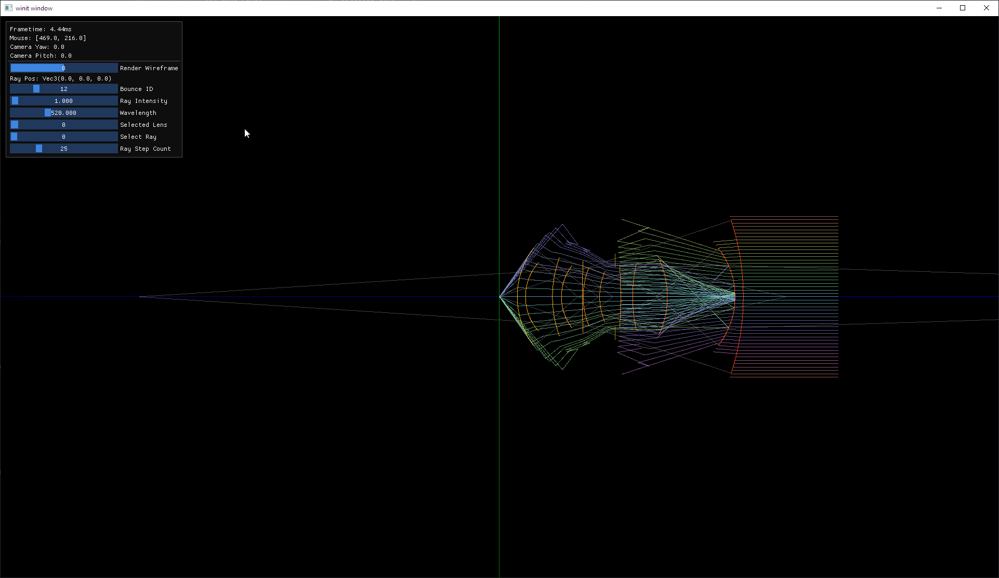
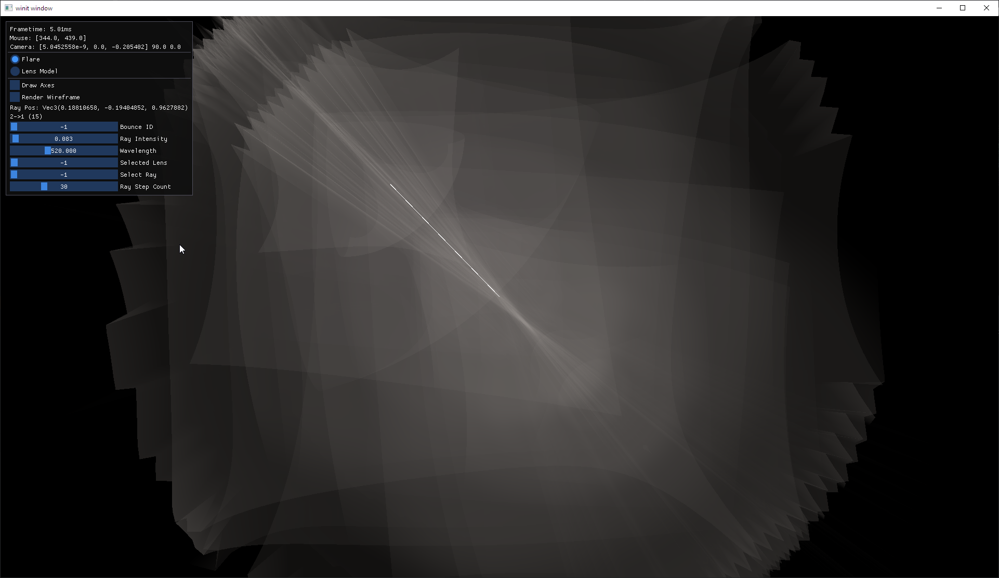
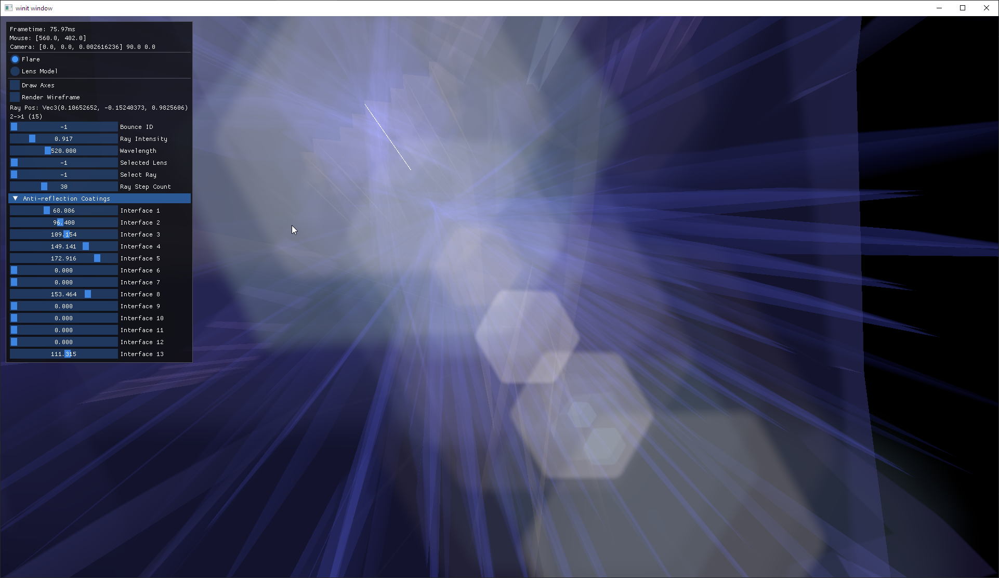
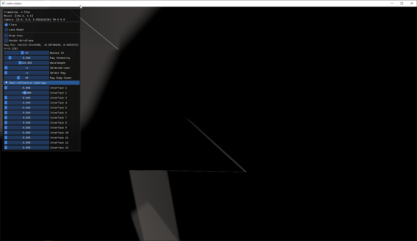
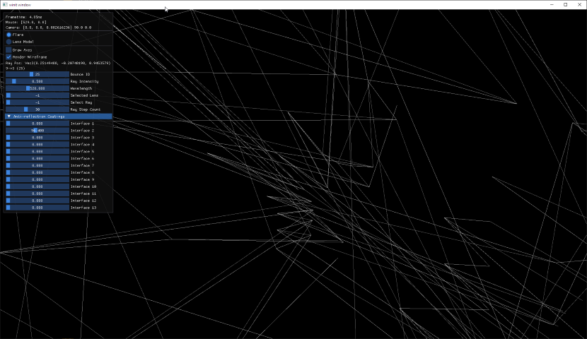
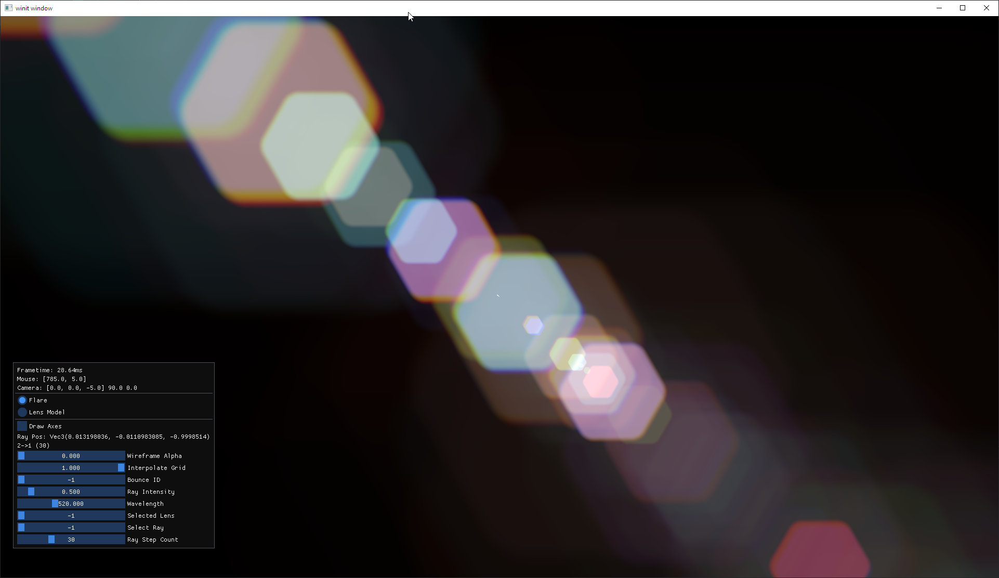

This is a work in progress.

This repo is a challenge to try and implement a paper with as little outside help as possible.

I decided to implement the lens flare effect from the paper [Physically-Based Real-Time
Lens Flare Rendering](https://resources.mpi-inf.mpg.de/lensflareRendering/) by Hullin, Eisemann, Seidel and Lee.

## Development notes

This is what I should have done initially, but didn't.

I relied on the [description of realistic cameras from the Physically Based Rendering book (3rd edition)](https://www.pbr-book.org/3ed-2018/Camera_Models/Realistic_Cameras)
to get a model of the lens system. 
Should have made sure the derived data can work with the unmodified tracing algorithm and made a debug diagram as above.

Instead, I started off by translating the code from the supplementary material of the paper and threw everything at it,
trying to see what will stick.

### 2025-11-11

Continued fiddling is starting to show some results that seem promising, but still incorrect, as can be seen below.

The part of the code that tries to limit the grid of traced rays to the dimensions that are certain to reach the sensor
needs some improvement. It currently does not take into consideration the possible angles of the rays. I believe this is
what causes the visual edges in the ghosts.

Adding a simple hot-reloading mechanism for the shaders was a good idea, even if it was a bit of a headache and took a
couple of hours. It sped up my iteration times quite a bit.

My next steps are to improve the code to shrink the grids as mentioned above, and adding some UI elements that will allow
me to play around with the `d1` parameter responsible for the anti-reflection coating of the lenses, to get some color 
into this.

After adding UI elements to control the `d1` parameters, adding code to select different resolutions for the ray grids 
and further improving the rendering, I think the behavior of the lens flare looks about right.

### 2025-11-17

At the moment, the shape of the ghosts, representing the shape of the aperture, is simply done by using a signed distance
field equation for a hexagon. This is different to the method used by the paper, of creating a texture by repeating the 
shape of an aperture "blade." It also skips the part of creating the ringing of the ghosts with FFTs.

At this point, however, I'm still getting some artifacts in the ghosts due to the grids folding over themselves.
The paper doesn't make clear how this is supposed to be handled, specifically with regard to the rendering pass of each
ghost.

I tried finding existing implementations of the paper, just to get a feeling for how different their code is from the 
direction I'm taking, without actually diving into the weeds and seeing any spoilers.

From a quick glance at the structure of [this GitHub repository](https://github.com/Peiteng/Physically-Based-Realtime-Lens-Flare),
it looks like their implementation is quite far off from mine. I am considering taking a deeper look at their code to at
least understand how the ghost rendering pass is supposed to work.

### 2025-11-18

Adding controls to view the grid's wireframe with the shading and to unwarp it, it seems that using math and 
signed-distance fields to create the ghosts causes artifacts due to the grid UVs being warped.

### 2025-11-20

Guess I have to admit to some failure. I decided to try adapting the lens models and a bit of code 
from the aforementioned repository.

Using their lens data, the grids end up looking correct, without the warping artifacts I was seeing before. 
I'm not sure if this is solely due to the fact that the lenses aren't scaled now, 
or if the model is just very different.

Having values for the anti-reflection coating also makes things look better.

Some color was lost when I adopted the code that is responsible for providing chromatic aberration and 
wavelength-dependent refraction, but I guess that's not really an issue.

It's awfully tempting to keep using the reference code, but I'll try to keep that to a minimum.

