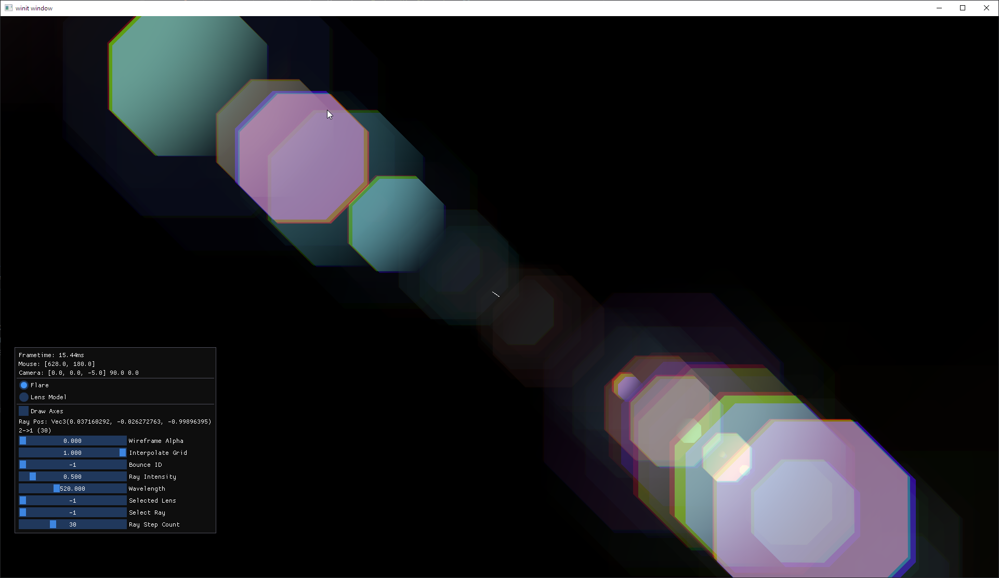
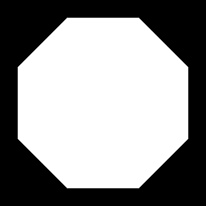
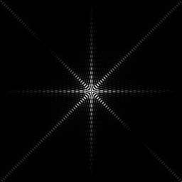
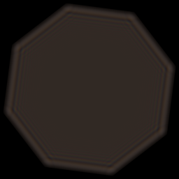
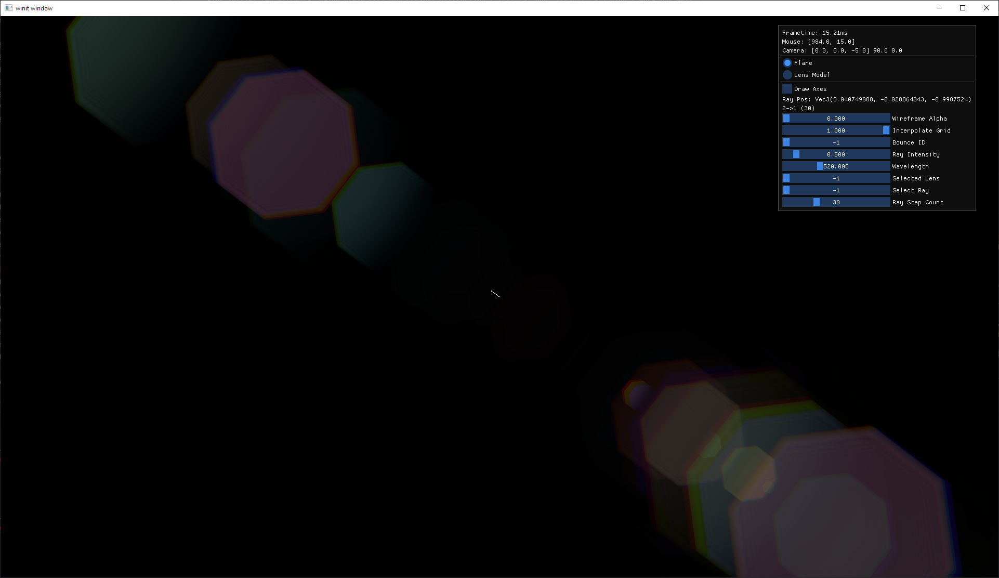

This is a work in progress.

This repo is a challenge to try and implement a paper with as little outside help as possible.

I decided to implement the lens flare effect from the paper [Physically-Based Real-Time
Lens Flare Rendering](https://resources.mpi-inf.mpg.de/lensflareRendering/) by Hullin, Eisemann, Seidel and Lee.

## Development notes

This is what I should have done initially, but didn't.

I relied on
the [description of realistic cameras from the Physically Based Rendering book (3rd edition)](https://www.pbr-book.org/3ed-2018/Camera_Models/Realistic_Cameras)
to get a model of the lens system.
Should have made sure the derived data can work with the unmodified tracing algorithm and made a debug diagram as above.

Instead, I started off by translating the code from the supplementary material of the paper and threw everything at it,
trying to see what will stick.

### 2025-11-11

Continued fiddling is starting to show some results that seem promising, but still incorrect, as can be seen below.

The part of the code that tries to limit the grid of traced rays to the dimensions that are certain to reach the sensor
needs some improvement. It currently does not take into consideration the possible angles of the rays. I believe this is
what causes the visual edges in the ghosts.

Adding a simple hot-reloading mechanism for the shaders was a good idea, even if it was a bit of a headache and took a
couple of hours. It sped up my iteration times quite a bit.

My next steps are to improve the code to shrink the grids as mentioned above, and adding some UI elements that will
allow
me to play around with the `d1` parameter responsible for the anti-reflection coating of the lenses, to get some color
into this.

After adding UI elements to control the `d1` parameters, adding code to select different resolutions for the ray grids
and further improving the rendering, I think the behavior of the lens flare looks about right.

### 2025-11-17

At the moment, the shape of the ghosts, representing the shape of the aperture, is simply done by using a signed
distance
field equation for a hexagon. This is different to the method used by the paper, of creating a texture by repeating the
shape of an aperture "blade." It also skips the part of creating the ringing of the ghosts with FFTs.

At this point, however, I'm still getting some artifacts in the ghosts due to the grids folding over themselves.
The paper doesn't make clear how this is supposed to be handled, specifically with regard to the rendering pass of each
ghost.

I tried finding existing implementations of the paper, just to get a feeling for how different their code is from the
direction I'm taking, without actually diving into the weeds and seeing any spoilers.

From a quick glance at the structure
of [this GitHub repository](https://github.com/Peiteng/Physically-Based-Realtime-Lens-Flare),
it looks like their implementation is quite far off from mine. I am considering taking a deeper look at their code to at
least understand how the ghost rendering pass is supposed to work.

### 2025-11-18

Adding controls to view the grid's wireframe with the shading and to unwarp it, it seems that using math and
signed-distance fields to create the ghosts causes artifacts due to the grid UVs being warped.

### 2025-11-20

Guess I have to admit to some failure. I decided to try adapting the lens models and a bit of code
from the aforementioned repository.

Using their lens data, the grids end up looking correct, without the warping artifacts I was seeing before.
I'm not sure if this is solely due to the fact that the lenses aren't scaled now,
or if the model is just very different.

Having values for the anti-reflection coating also makes things look better.

Some color was lost when I adopted the code that is responsible for providing chromatic aberration and
wavelength-dependent refraction, but I guess that's not really an issue.

It's awfully tempting to keep using the reference code, but I'll try to keep that to a minimum.

### 2025-11-21

Decided to move on to improving the flare ghosts look. Right now I'm only rendering a basic, regular white n-gon as the
texture for the ghosts.

The next step will be to improve the texture using the Fourier Transform-related methods described in the paper,
to get the ringing and color effects around the edges of the polygon.

For this feature, I will again try to avoid referencing the code from the repository mentioned above and instead try to
implement things myself based on the paper and the related papers it references for this.

### 2025-11-23

Started work on improving the texture of the ghosts.

The paper improves the ghost from a plain solid polygon by applying a Fractional Fourier Transform (FrFT) to the
ghost's texture. In this case, this is like a "partial" Fourier Transform, or an incomplete "rotation" from the image's
spatial domain and its frequency domain. The result is essentially an interpolation between the original image and
its Fourier Transform.

This ends up giving the ghost a "ringing" effect around the edges, which is consistent with what you can see in some
real-life photographs.

To accomplish this, I used ChatGPT to learn about FrFT and FFT, while explicitly asking it to not give me any code
snippets.

First, I had to implement a Fast Fourier Transform (FFT). I relied on a paper from Microsoft, which ChatGPT found:
[Fast Computation of General Fourier Transforms on GPUs](https://www.microsoft.com/en-us/research/wp-content/uploads/2016/02/tr-2008-62.pdf).

This paper describes a GPU-friendly implementation, which possibly isn't the best variation to implement on CPU.
However, I started with a CPU implementation anyway, so I can understand the algorithm and be able to test and compare
its results to the [`rustfft`](https://docs.rs/rustfft/latest/rustfft/) crate.

I took me an entire day to get _something_ working, but I'm happy to say it works and returns results that were compared
to the ones returned from the crate.

Also managed to adapt it to work on images in the same manner described by ChatGPT. Again, without relying on any
code snippets, but only its explanation. ChatGPT even provided suggestions and a useful roadmap for implementing
everything, including tips for debugging the code in locations where it's likely to fail.

On the left is the original polygon image, and to its right is the Fourier-transformed image.

As a side note, I'm highly impressed by ChatGPT's ability to explain and teach topics. It does a fantastic job at it,
and its infinite patience for questions is great for learning. Wish we had this tool 20 years ago.

### 2025-11-29

This update is a culmination of about 4 days of work. It took a _lot_ of trial and error, but the flare ghost now has
its ringing effect.

Most of the work done in this update was done along with talking with ChatGPT to learn about
Fractional Fourier Transforms and other related methods, with as little source code generated by ChatGPT as I could
manage.

The initial two attempts, using plain FrFT and Fresnel Diffraction (`frft.rs` and `fresnel.rs`) didn't work out well,
so following in the footsteps of the reference implementation, I tried implementing the
Angular Spectrum (`angular_spectrum.rs`) method, which it uses.

At first, my work was producing an incorrect result, which took a good while to debug, as I thought the implementation
was correct and the issue was down to my choice of parameters. I wasted a good few hours trying to make small
variations in the code and tweak the parameters to no avail.

However, after eventually trying to use the same parameters as the reference implementation, I was still getting
results that were different from the reference.

At this point I decided to, again, look deeper into the reference code to try and find any differences.

Using [NVIDIA Nsight Graphics](https://developer.nvidia.com/nsight-graphics), I could compare the generated buffers and
textures generated in the process, which finally led me to find the issue in my code.

My error was not shifting the results of the FFT once it processes the data (an operation known as `fftshift`).
Not applying this operation caused only a subtle-looking difference in the results, and I danced around this spot for
a while, trying to make both similar and unrelated changes which didn't help.

I can't say this came as a breakthrough stroke of genius. I was one possible issue in a list provided by ChatGPT,
which just caused me to try it again, eventually landing on the correct place it was missing while trying to make
something stick.

I haven't decided yet what to take as the next step. Some of my options are implementing the ghost generation on GPU,
improving color management (i.e., adding HDR support and tone mapping), or adding the light burst at the light's origin.
